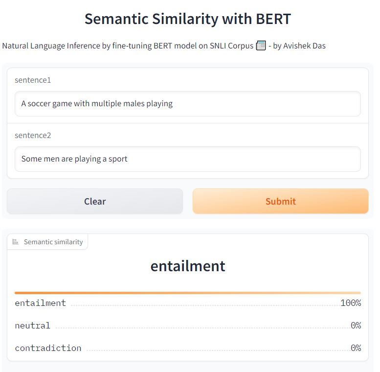

# Bert-based Semantic Similarity
Semantic Similarity is the task of determining how similar
two sentences are, in terms of what they mean.
This example demonstrates the use of SNLI (Stanford Natural Language Inference) Corpus
to predict sentence semantic similarity with Transformers.
We have fine-tuned a BERT model that takes two sentences as inputs
and that outputs a similarity score for these two sentences.

**Dataset Used:**
- The Stanford Natural Language Inference (SNLI) Corpus [SNLI](https://nlp.stanford.edu/projects/snli/)

  The Stanford Natural Language Inference (SNLI) corpus (version 1.0) is a collection of 570k human-written English sentence pairs manually labeled for balanced classification with the labels entailment, contradiction, and neutral. We aim for it to serve both as a benchmark for evaluating representational systems for text, especially including those induced by representation-learning methods, as well as a resource for developing NLP models of any kind.

## Deployment on HuggingFace Space(GRADIO version)

- [Trained model Card](https://huggingface.co/avishek-018/bert-semantic-similarity)
- [Deployment Space](https://avishek-018-bert-semantic-similarity.hf.space)
  

